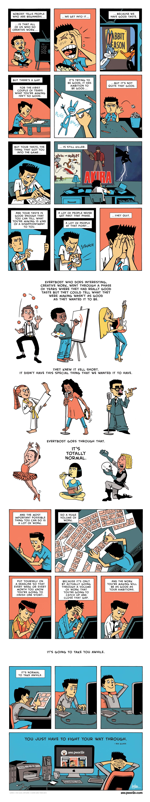

## Why research?

There are many socio-economic benefits to research.
Most modern economies have been founded on some technological innovation or the other: the steam engine, industrial tools, the telegram, electric appliances, the computer, the internet, modern medicine, etc.

Some people find software exciting, some find sales addictive, some take to management, some find joy in sports and similarly, some find research interesting.
It's a great way to engage oneself professionally, and most who do find it to also be a deeply meditative process.

### Is research for me?

Are you generally curious about how the world works?
Do you have a tendency to ask questions and dig deeper in your work?
In your free time, do you tend to read up a little more about some of your coursework, to really understand how the pieces fit together?
Are you generally curious about the different concepts you are introduced to in the courses you sit through?
If yes, then you will likely enjoy research.
Most of research is driven by curiosity--the "what if" or "how does this work" questions should motivate you to keep at it.

### What if I don't like research?

That's fine!
There are a bunch of other things you can do with your time.
Coming to the realization that you perhaps do not enjoy research itself is a worthy lesson.
Many take years until they learn this about themselves.
It is perfectly fine if you do not end up enjoying research; not everyone needs to be engaged in or enjoy it.

### What should I start off with?

Do not worry about which topic to start off with.
Typically, you'll likely find one or more courses that will likely attract you more than others--those are great starting points.
Trying out some harder exercises from textbooks is a good way to get really involved.
If you're interested in empirical or systems-related topics, implementing ideas you see in class or read in your textbooks, and thinking through modest ways to extend these projects is again a very concrete way to get started.

If you find yourself being able to sustain this interest in a topic, you're very likely ready for some more serious work.
That said, finding the right mentorship is also crucial at such a point to hone and cultivate the nascent interest you develop.
That's where trying out research internships, summer research programs, etc. can help.
We discuss this more in _Module 3 - Skills [part 1](m3/) and [part 2](m4/)_.

Note - there's a reverse ask here as well.
If some research mentor (faculty, senior graduate student) takes time out to mentor you, what can you do to ensure they feel their time is well spent on you.
Doing research is definitely more commitment than doing courses.
We'll visit this in [Module 3 - Skills: Part 1](./m3/).

### I find some topics very fascinating but I suck at them

Alright.
You read the blurb above, and tried out a few harder exercises or tried implementing an idea in a subject you find interesting.
And you failed at it.
You found them too hard, or too overwhelming and intractable to start off with.
Should you call it a day and conclude that you're not interested in research?
Most definitely no.
Think of research as any other skill like drawing, driving a car, learning to use a skipping rope, or playing chess.
They all require a good deal of effort, and mastery takes years.
What matters is your sense of curiosity, and a taste for the aesthetic that the topic offers.
If you find this sense of curiosity strong enough, it will likely motivate you to put in the hours to gain mastery in the topics you're fascinated by.

A related point - the comic below illustrates Ira Glass's advice for beginners, as illustrated by [Gavin Than](https://aungthan.com/) in his webcomic [Zen Pencils](https://zenpencils.com)

